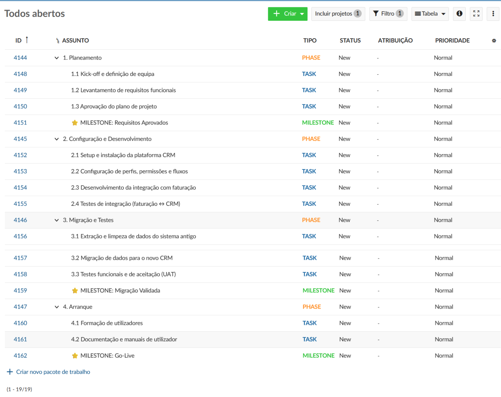
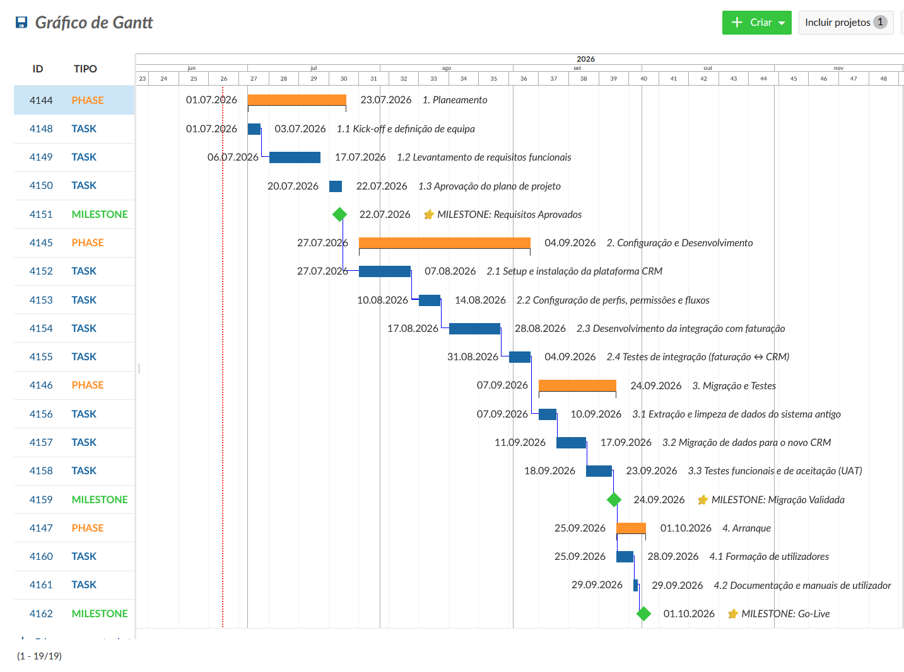
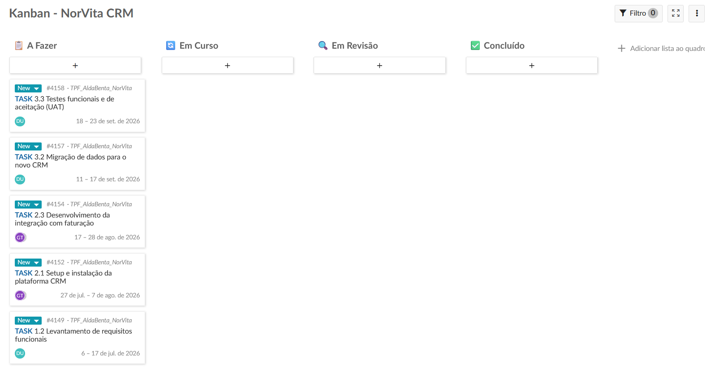
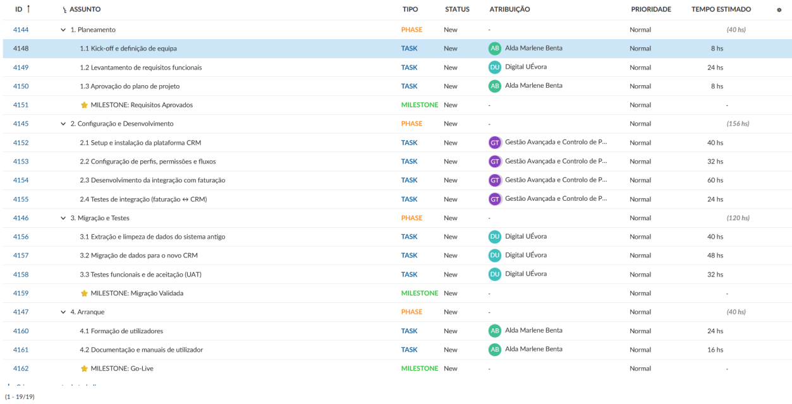
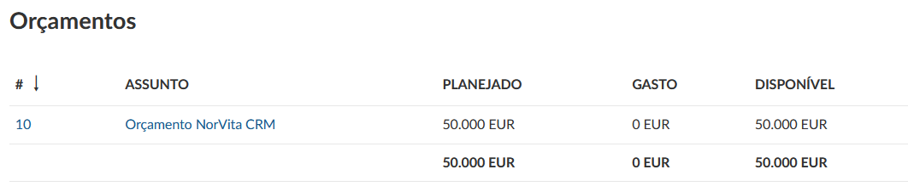
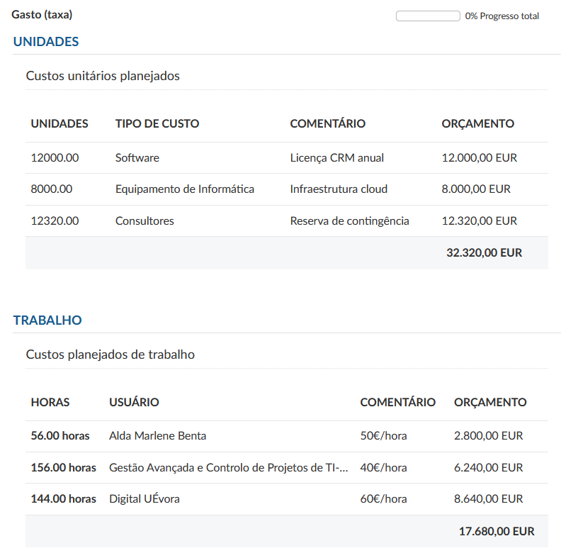
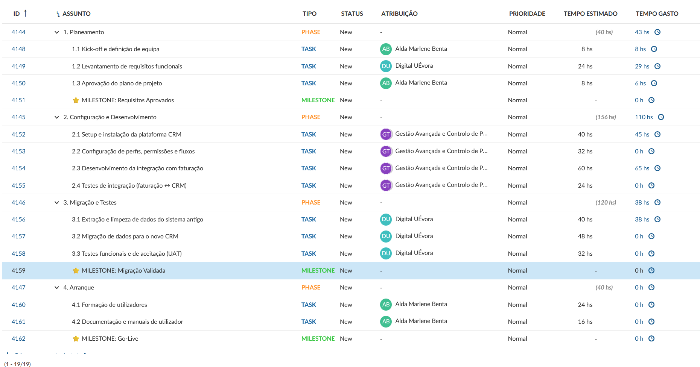

# Implementação de CRM em Cloud — NorVita, S.A.

Trabalho prático final da unidade **Gestão Avançada e Controlo de Projetos de TI**, desenvolvido na plataforma **OpenProject**.

## Resumo

Planeamento e controlo de um projeto de substituição do sistema de gestão de clientes por uma plataforma CRM em cloud, integrada com o sistema de faturação existente.

| | |
|---|---|
| **Orçamento aprovado (BAC)** | 50.000 € |
| **Prazo** | 3 meses |
| **Metodologia** | Waterfall (cascata) |
| **Ferramenta** | OpenProject |

## Conteúdo do trabalho

| Fase | Entregáveis |
|---|---|
| **A. Governança e configuração** | Project Charter, objetivos e critérios de sucesso mensuráveis, âmbito, matriz RACI e regra de escalonamento |
| **B. Metodologia, âmbito e cronograma** | Justificação da escolha de Waterfall, WBS, Gantt e quadro Kanban |
| **C. Gestão de riscos** | Registo de 5 riscos (matriz probabilidade × impacto) e estratégias de resposta |
| **D. Recursos e orçamento** | Atribuição de esforço, correção de sobrealocação, orçamento e registo de tempo (planeado vs. real) |
| **E. Monitorização (EVM)** | PV, EV, AC, SV, CV, SPI, CPI e EAC na semana 6, com medidas corretivas |

## Resultados da análise Earned Value (semana 6)

Com PV = 20.000 €, EV = 18.000 € e AC = 20.000 €:

- **SPI = 0,90** e **CPI = 0,90**: projeto atrasado e acima do custo previsto
- **EAC ≈ 55.556 €**, cerca de 11% acima do BAC, o que obriga a escalar ao Sponsor (desvio superior a 10%)

## Capturas de ecrã

### WBS

### Gráfico de Gantt

### Quadro Kanban

### Atribuição de recursos e esforço

### Orçamento

### Registo de tempo

## Documento completo

📄 [Relatório completo (PDF)](Relatorio_TPF_AldaBenta.pdf)

## Competências demonstradas

Governança de projeto · Planeamento e cronogramas · Gestão de riscos · Orçamentação e gestão de recursos · Earned Value Management · OpenProject

## Autora

Alda Benta
<!-- Adicione aqui a ligação para o seu perfil de LinkedIn -->
